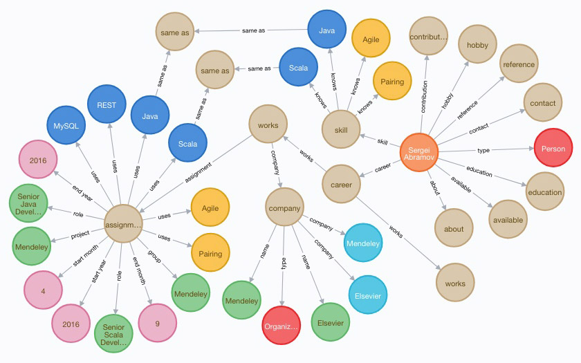
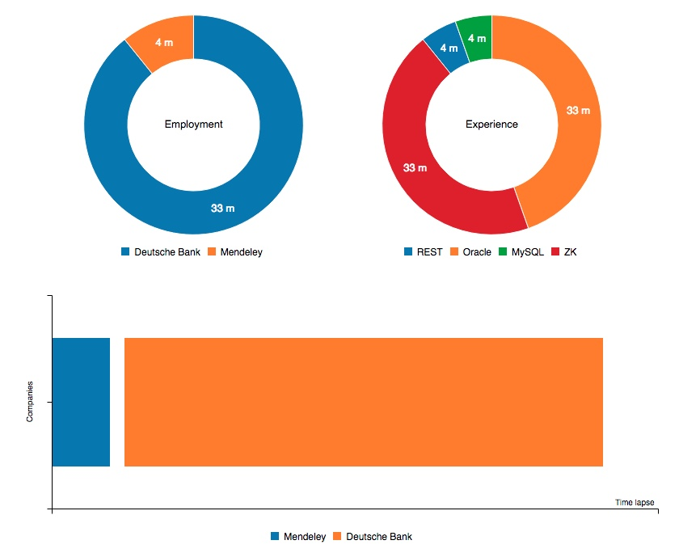

# Interactive CV #

Convert your CV (Resume) into graphs and diagrams so your future employer has something to play with.

Feedback email cftp@coldcore.com





## Demo ##

See it in action at https://cv.coldcore.com

## Running the app ##

Install [SBT](http://www.scala-sbt.org) to build and run the app. Then clone the repository and from the project directory `sbt run`:

```
$ sbt "run src/test/resources/samples"
[info] ...
[info] Running com.coldcore.icv.Runner
```

The app processes files and writes to the project output directory

## Installation ##

Use automated installation for Vagrant to build and run everything. If you prefer to install manually, refer
to the automated scripts. The scripts come as individual steps and should be easy to read.

## Contribution policy ##

Contributions via pull requests are gladly accepted from their original author. Along with any pull requests, please state that the
contribution is your original work and that you license the work to the project under the project's open source license. Whether or not
you state this explicitly, by submitting any copyrighted material via pull request, email, or other means you agree to license the
material under the project's open source license and warrant that you have the legal authority to do so.

## License ##

This code is open source software licensed under the [GNU Lesser General Public License v3](http://www.gnu.org/licenses/lgpl-3.0.en.html).

## Change log ##
### 0.1 ###
* Consumes n-triple files
* Builds Neo4j graphs connected with each other
* Builds simple C3 charts
* Neovis graph visualization
* RDF schema is restricted to my CV tokens
* Node.js frontend
* Excel template to convert CV into triples.
